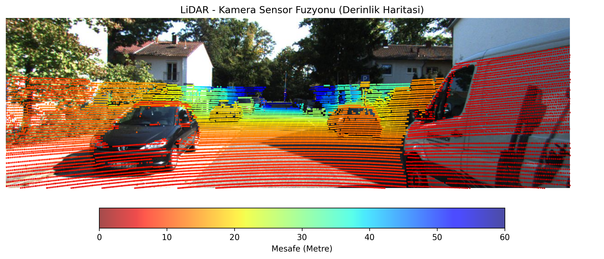
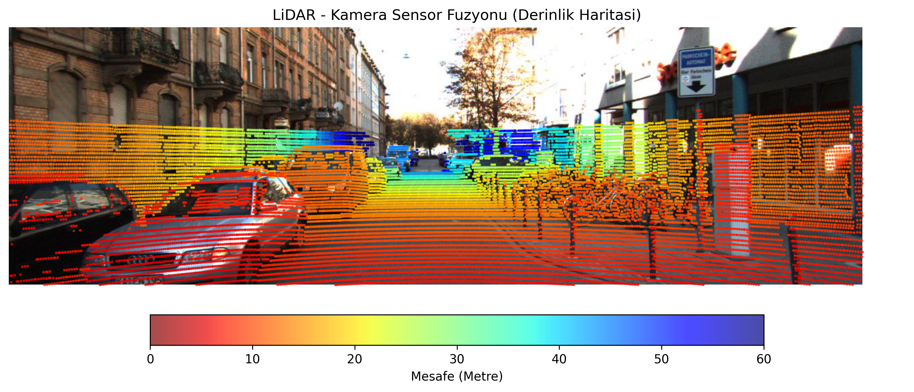
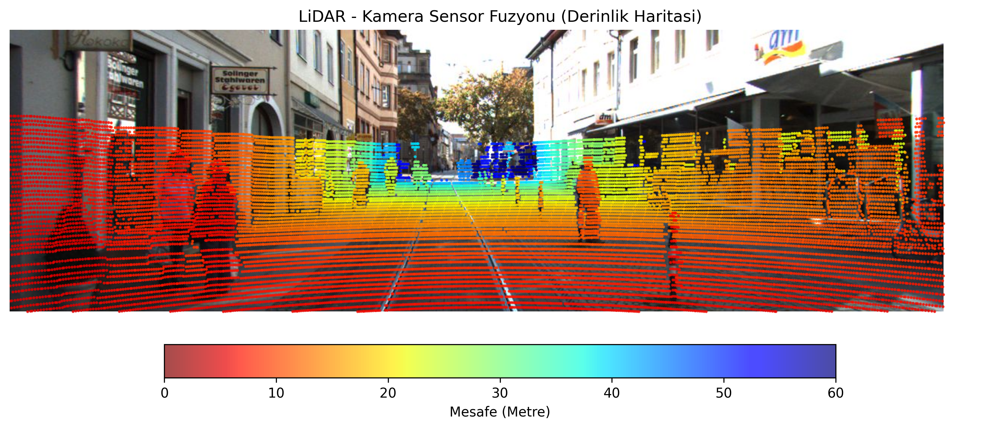

# LiDAR - Kamera Sensör Füzyonu ve Derinlik İzdüşümü (KITTI Veri Seti)

Bu proje, otonom sürüş sistemlerinde çevresel algılamayı güçlendirmek amacıyla **3B Velodyne LiDAR nokta bulutu (Point Cloud)** verilerini **2B Kamera görüntüsü** üzerine izdüşüren ve mesafeye duyarlı bir derinlik haritası (depth map) üreten modüler bir sensör füzyonu boru hattıdır (pipeline).

---

## Matematiksel Temeller ve Projeksiyon Zinciri

LiDAR sensörünün uzamsal koordinat sisteminden kamera görüntü sensörünün piksel koordinatlarına geçiş, **Pinhole (İğne Deliği) Kamera Modeli** ve **Homojen Dönüşüm Matrisleri** zinciri kullanılarak gerçekleştirilir.

### 1. Homojen Koordinat Dönüşümü
Ham LiDAR ikili (`.bin`) verisindeki her nokta $[X, Y, Z, R]$ formatındadır. Buradaki $R$ (yansıma şiddeti / reflectance) uzamsal bir koordinat olmadığı için elenir. $X, Y, Z$ koordinatları; rotasyon (dönme) ve öteleme (kayma) işlemlerinin tek bir matris çarpımıyla yürütülebilmesi için homojen koordinat sistemine taşınır:

$$X_{velo}^{hom} = \begin{bmatrix} X \\ Y \\ Z \\ 1 \end{bmatrix}$$

### 2. Projeksiyon Zinciri (Matris Çarpımı)
LiDAR koordinat sisteminden kamera piksel düzlemine geçiş, KITTI kalibrasyon dosyalarından çekilen 3 temel matrisin sağdan sola çarpımıyla tek bir $(3 \times 4)$ birleşik projeksiyon matrisine indirgenir:

$$T_{proj} = P_2 \cdot R_0^{rect} \cdot Tr_{velo \to cam}$$

* **$Tr_{velo \to cam}$ ($4 \times 4$ - Dışsal / Extrinsic Matris):** LiDAR sensörünün merkezini referans gri tonlamalı kameranın (Camera 0) optik merkezine taşıyan rotasyon ve öteleme matrisidir.
* **$R_0^{rect}$ ($4 \times 4$ - Doğrultma / Rectification Matrisi):** Stereo kamera tertibatındaki kameraların açısal sapmalarını gideren ve görüntü düzlemlerini ortak bir doğrultuya hizalayan matristir.
* **$P_2$ ($3 \times 4$ - İçsel / Intrinsic Projeksiyon Matrisi):** Doğrultulmuş 3B kamera koordinatlarını renkli sol kameranın (Camera 2) 2B piksel koordinatlarına izdüşüren içsel kamera parametrelerini (odak uzaklığı $f_x, f_y$ ve optik merkez $c_x, c_y$) barındırır.

### 3. Perspektif Normalizasyonu ($u, v$ Hesaplama)
Birleşik projeksiyon matrisi ile homojen noktalar çarpıldığında elde edilen sonuç ölçeklenmiş homojen piksel koordinatlarıdır:

$$\begin{bmatrix} x \\ y \\ z \end{bmatrix} = T_{proj} \cdot X_{velo}^{hom} = \begin{bmatrix} u \cdot z \\ v \cdot z \\ z \end{bmatrix}$$

Pinhole kamera modeline göre gerçek görüntü düzlemindeki $(u, v)$ piksel indislerine ulaşmak için perspektif bölme (normalizasyon) uygulanır:

$$u = \frac{x}{z} \quad (\text{Yatay piksel ekseni / Genişlik})$$

$$v = \frac{y}{z} \quad (\text{Dikey piksel ekseni / Yükseklik})$$

Buradaki $z$, noktanın kameraya olan gerçek derinliğidir (metre cinsinden mesafe).

### 4. Alan Maskeleme (Field of View Filtreleme)
LiDAR $360^\circ$ tarama yaptığı için sensörün arkasında kalan veya kameranın görüş alanı ($W \times H$) dışında kalan noktalar mantıksal bir Boolean maskesi ile elenir:

$$\text{Maske} = (z > 0) \land (0 \le u < W) \land (0 \le v < H)$$

* **$z > 0$:** Aracın arkasında kalan negatif derinlikli noktaları eler.
* **$0 \le u < W$ ve $0 \le v < H$:** Fotoğraf sınırları dışındaki pikselleri ayıklar.

---

## Proje Mimarisi

```text
cam_lidar_fusion/
│
├── kitti_tiny/              # KITTI veri seti klasörü
│   └── training/
│       ├── calib/           # Kalibrasyon metin dosyaları (Tr_velo_to_cam, R0_rect, P2)
│       ├── image_2/         # RGB kamera görüntüleri (.jpeg)
│       └── velodyne/        # Ham LiDAR ikili (.bin) nokta bulutu dosyaları
│
├── results/                 # Füzyon çıktılarının kaydedildiği dizin
│
└── src/
    ├── data_loader.py       # .bin, .txt ve görsel verilerini okuyan I/O modülü
    ├── projection.py        # Lineer cebir dönüşümleri, izdüşüm ve maskeleme modülü
    ├── visualizer.py        # Matplotlib tabanlı derinlik renklendirme ve çizim modülü
    └── main.py              # Tüm veri setini işleyen uçtan uca pipeline döngüsü
```
---

## Modül Açıklamaları

* **`data_loader.py`**
  * `load_lidar_points()`: `.bin` dosyasını `float32` tipinde $(N, 4)$ boyutlu NumPy matrisi olarak ayrıştırır.
  * `load_calibration()`: `.txt` kalibrasyon dosyasındaki matrisleri etiketleriyle okur; $Tr_{velo \to cam}$ ve $R_0^{rect}$ matrislerini $(4 \times 4)$ homojen forma genişletir.
  * `load_image()`: Kamera görüntüsünü OpenCV ile okuyup BGR formatından standart RGB renk uzayına çevirir.

* **`projection.py`**
  * `prepare_lidar_points()`: Nokta bulutunu homojen forma ($[X, Y, Z, 1]$) getirir.
  * `compute_projection_matrix()`: $P_2 \times R_0^{rect} \times Tr_{velo \to cam}$ zincir çarpımını hesaplar.
  * `project_to_camera_frame()`: $(3 \times 4)$ matrisi transpozu alınmış $(4 \times N)$ noktalarla çarparak $(3 \times N)$ uzayına indirger.
  * `normalize_to_pixel_coords()`: $u = x/z$ ve $v = y/z$ bölümlerini yaparak derinlik dizisini ($z$) ayırır.
  * `filter_points_in_img()`: Kamera çerçevesine ve önüne düşen geçerli noktaları filtreler.

* **`visualizer.py`**
  * `plot_lidar_on_image()`: Görsel üzerine LiDAR noktalarını `jet_r` renk skalasıyla bindirir. Yakın mesafedeki nesneler **kırmızı**, uzak mesafedeki nesneler **mavi** renkle çizilir. Bellek sızıntısını önlemek için `plt.close` ile optimize edilmiştir.

* **`main.py`**
  * `run_batch_pipeline()`: `velodyne/` altındaki tüm kareleri otomatik tarar, modülleri koşturur ve sonuçları toplu şekilde `results/` klasörüne yazar.

---

## Kullanılan Teknolojiler

* **Python 3.11+**
* **NumPy:** Matris çarpımları (`@`), homojen dönüşümler ve vektörel maskeleme operasyonları.
* **OpenCV (`cv2`):** Görüntü I/O ve RGB renk dönüşümü.
* **Matplotlib:** `jet_r` renk haritası ile derinliğe duyarlı scatter plot, yatay colorbar ve figür bellek yönetimi.

## Örnek Füzyon Çıktıları

Pipeline'ın farklı kentsel senaryolardaki derinlik izdüşüm performansı:

| Dar Sokak ve Araç Algılama (000053) | Yoğun Trafik ve Park Alanı (000068) |
| :---: | :---: |
|  |  |

<p align="center">
  <b>Yaya Bölgesi ve Tramvay Hattı (000073)</b><br>
  
</p>